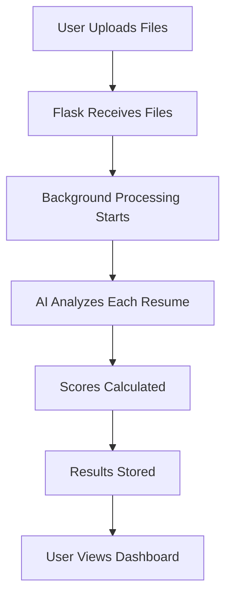

# 📁 Project Structure

## 🗂️ File Organization

```
📦 AI-Resume-Matcher/
├── 🐍 **Core Application**
│   ├── app.py                    # Main Flask web application
│   ├── resume_matcher.py         # AI-powered resume analysis engine
│   ├── start_windows.py          # Windows-optimized server launcher
│   └── run_server.py             # Cross-platform server launcher
│
├── ⚙️ **Configuration**
│   ├── requirements.txt          # Python dependencies
│   ├── .env-example             # Environment variables template
│   ├── .env                     # Your API keys (not in repo)
│   └── runtime.txt              # Python version specification
│
├── 🚀 **Deployment**
│   ├── Procfile                 # Process configuration for cloud
│   ├── render.yaml              # Render.com deployment config
│   ├── build.sh                 # Build script for cloud deployment
│   └── RENDER_DEPLOYMENT.md     # Cloud deployment guide
│
├── 🎨 **Frontend Templates**
│   └── templates/
│       ├── base.html           # Base template with common elements
│       ├── index.html          # Home page with file upload
│       ├── processing.html     # Real-time progress tracking
│       ├── results.html        # Analysis results dashboard
│       ├── 404.html           # Error page for not found
│       └── 500.html           # Error page for server issues
│
├── 📂 **Working Directories** (Created automatically)
│   ├── uploads/               # Temporary file uploads
│   ├── temp/                  # Processing workspace
│   ├── results/               # Cached analysis results
│   └── out/                   # Generated markdown resumes
│
├── 📋 **Documentation**
│   ├── README.md              # Main project documentation
│   ├── PROJECT_STRUCTURE.md   # This file
│   ├── DEPLOYMENT_CHECKLIST.md # Deployment guide
│   └── LICENSE                # Project license
│
└── 📊 **Sample Data**
    └── EXAMPLE job_description.txt # Sample job posting for testing
```

## 🔧 Key Components Explained

### **Core Application Files**

#### `app.py` - Main Web Application
- **Purpose**: Flask web server providing REST API and web interface
- **Features**: File upload, progress tracking, results display, error handling
- **Routes**: 
  - `/` - Home page
  - `/upload` - File upload endpoint
  - `/status/<id>` - Progress checking
  - `/results/<id>` - Analysis results
  - `/processing/<id>` - Processing page

#### `resume_matcher.py` - AI Analysis Engine
- **Purpose**: Core AI-powered resume analysis and scoring
- **Features**: Multi-model AI integration, scoring algorithms, data processing
- **Functions**:
  - `process_resumes()` - Main processing pipeline
  - `match_resume_to_job()` - Individual resume scoring
  - `unify_format()` - Resume standardization
  - `extract_job_requirements()` - Job analysis

#### `start_windows.py` - Windows Launcher
- **Purpose**: Windows-optimized server startup script
- **Features**: Socket error prevention, proper cleanup, logging
- **Benefits**: Avoids common Windows threading and socket issues

### **Configuration Files**

#### `requirements.txt` - Dependencies
```python
Flask==3.0.0           # Web framework
openai>=1.0.0          # AI API client
PyPDF2==3.0.1         # PDF processing
python-dotenv>=1.0.0   # Environment variables
# ... and more
```

#### `.env-example` - Environment Template
```bash
OPENROUTER_API_KEY=your_api_key_here
ANTHROPIC_MODEL=claude-3-5-sonnet-20240620
OPENROUTER_MODEL=deepseek/deepseek-chat
DEFAULT_MAX_TOKENS=4000
```

### **Deployment Configuration**

#### `Procfile` - Process Definition
```bash
web: python app.py
```

#### `render.yaml` - Cloud Configuration
```yaml
services:
  - type: web
    name: resume-matcher
    env: python
    buildCommand: pip install -r requirements.txt
    startCommand: python app.py
```

### **Frontend Templates**

#### Template Hierarchy
- **`base.html`**: Common layout, navigation, styles
- **`index.html`**: Extends base, adds upload interface
- **`processing.html`**: Extends base, adds progress tracking
- **`results.html`**: Extends base, adds results dashboard

#### Key Features
- **Responsive Design**: Works on desktop and mobile
- **Drag & Drop**: Intuitive file upload interface
- **Real-Time Updates**: Live progress tracking
- **Modern UI**: Clean, professional appearance

### **Data Flow**



#### Processing Pipeline
1. **File Upload**: User uploads job description and resumes (ZIP)
2. **File Extraction**: System extracts text from various formats
3. **AI Analysis**: DeepSeek AI evaluates each resume against job requirements
4. **Scoring**: Multi-criteria scoring with weighted factors
5. **Results Generation**: Rankings, statistics, and insights
6. **Dashboard Display**: Interactive results with export options

### **Security & Best Practices**

#### File Handling
- **Secure Upload**: Validates file types and sizes
- **Temporary Storage**: Automatic cleanup of processed files
- **Path Sanitization**: Prevents directory traversal attacks

#### API Security
- **Environment Variables**: API keys stored securely
- **Rate Limiting**: Prevents API abuse
- **Error Handling**: Graceful failure without exposing internals

#### Data Privacy
- **Temporary Processing**: Files deleted after analysis
- **No Persistent Storage**: Candidate data not permanently stored
- **GDPR Compliance**: Designed for privacy-conscious usage

### **Development Workflow**

#### Local Development
1. Clone repository
2. Install dependencies: `pip install -r requirements.txt`
3. Configure environment: Copy `.env-example` to `.env`
4. Start server: `python start_windows.py` (Windows) or `python run_server.py`
5. Access at: `http://127.0.0.1:5000`

#### Testing
1. Use `EXAMPLE job_description.txt` as sample job posting
2. Create ZIP file with sample resumes
3. Upload through web interface
4. Monitor processing in real-time
5. Review results dashboard

#### Deployment
1. Push to GitHub repository
2. Connect to Render.com
3. Configure environment variables
4. Deploy automatically
5. Monitor logs for issues

This structure provides a clean separation of concerns, making the project maintainable, scalable, and easy to understand for hackathon judges and contributors.